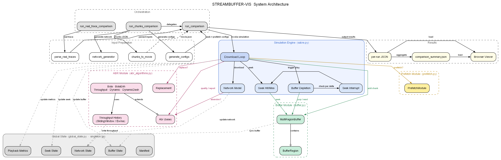
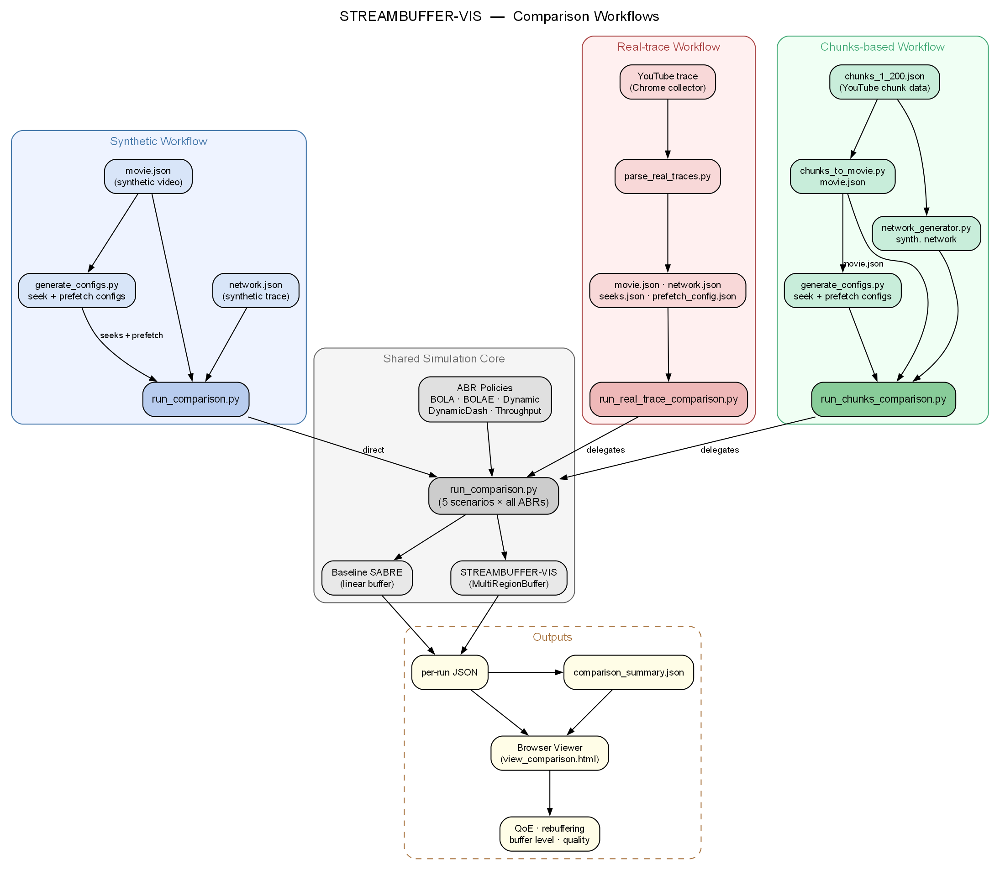

# STREAMBUFFER-VIS Simulation Guide

STREAMBUFFER-VIS is a Python-based simulation environment for evaluating Adaptive Bitrate (ABR) streaming algorithms under realistic seek and prefetch conditions. It extends the original SABRE simulator with a dynamic multi-region buffer (`MultiRegionBuffer`) that preserves buffered segments across seek events and supports out-of-order prefetch downloads.

---

## Table of Contents

- [System Architecture](#system-architecture)
- [Comparison Workflows](#comparison-workflows)
- [Workflow Summary](#workflow-summary)
- **Part I — Core Simulation**
  - [Setup & Prerequisites](#setup--prerequisites)
  - [Network Configuration](#network-configuration)
  - [Running Simulations](#running-simulations)
  - [Graph Generation](#graph-generation)
  - [Regression Testing](#regression-testing)
- **Part II — Dynamic Buffering (`buffer.py`)**
  - [Overview](#overview)
  - [Running Buffer Comparisons](#running-buffer-comparisons)
  - [Viewing Results](#viewing-results)
  - [Understanding Results](#understanding-results)
  - [Generating Seek & Prefetch Configs](#generating-seek--prefetch-configs)
  - [Prefetch Comparison Workflow (Synthetic)](#prefetch-comparison-workflow-synthetic)
  - [Testing](#testing)
  - [Use Cases: Detailed Flow](#use-cases-detailed-flow-documentation)
  - [Technical Reference](#technical-reference)
  - [Advanced Usage](#advanced-usage)
  - [Troubleshooting](#troubleshooting)
- **Part III — Real-trace Workflow**
  - [Collecting Traces](#collecting-traces)
  - [Parsing Traces](#parsing-traces)
  - [Real Trace Prefetch Scenarios](#real-trace-prefetch-scenarios)
  - [Running Real Trace Comparisons](#running-real-trace-comparisons)
- **Part IV — Chunks-based Workflow**
  - [Chunks Video Library](#chunks-video-library)
  - [Running Chunks Comparisons](#running-chunks-comparisons)
  - [Chunks Comparison Options](#chunks-comparison-options)
- **Reference**
  - [File Structure](#file-structure)

---

## System Architecture

The diagram below shows the module structure and component relationships of STREAMBUFFER-VIS.



---

## Comparison Workflows

STREAMBUFFER-VIS supports three comparison workflows — **Synthetic**, **Real-trace**, and **Chunks-based** — all converging into a shared simulation core that runs each scenario with and without `MultiRegionBuffer`.



---

## Workflow Summary

| | Synthetic | Real-trace | Chunks-based |
|---|---|---|---|
| **Movie** | `synthetic/movie.json` | Any `movie.json` | Entry from `chunks_1_200.json` |
| **Network** | Synthetic (`network_generator.py`) | Real (`network_<uuid>.json`) | Synthetic (generated) |
| **Seeks** | Generated (`generate_configs.py`) | Real (`seeks_<uuid>.json`) | Generated (`generate_configs.py`) |
| **Prefetch configs** | Generated from video structure | Derived from real seek destinations | Generated from video structure |
| **Runner** | `run_comparison.py` | `run_real_trace_comparison.py` | `run_chunks_comparison.py` |
| **Results** | `synthetic/results/` | `real_trace/results/` | `chunks_trace/results/` |

---

# Part I — Core Simulation

---

## Setup & Prerequisites

### Install Dependencies
```bash
pip install numpy
```

### Required Files
- `synthetic/network.json` — Network trace file (can be generated)
- `synthetic/movie.json` — Movie manifest file
- `synthetic/seeks.json` — Seek configuration (optional)

---

## Network Configuration

### Generate network.json

Generate network conditions using `network_generator.py`:

```bash
python network_generator.py -ne 10 -d 4000 -bm 3000 -bs 1500 -lm 150 -ls 50
```

**Parameters:**
- `-ne, --num-entries`: Number of network condition entries (default: 10)
- `-d, --duration`: Total duration in milliseconds (default: 4000)
- `-bm, --bandwidth-mean`: Mean bandwidth (default: 3000)
- `-bs, --bandwidth-std`: Bandwidth standard deviation (default: 1500)
- `-lm, --latency-mean`: Mean latency (default: 150)
- `-ls, --latency-std`: Latency standard deviation (default: 50)

**Example:**
```bash
python network_generator.py -ne 20 -d 6000 -bm 5000 -bs 2000 -lm 100 -ls 30
```

---

## Running Simulations

### Basic Simulation

Run simulation with default settings:
```bash
python sabre.py -n synthetic/network.json -m synthetic/movie.json
```

### With Verbose Output
```bash
python sabre.py -v -n synthetic/network.json -m synthetic/movie.json
```

### With Seek Configuration

Run with seeks:
```bash
python sabre.py -v -n synthetic/network.json -m synthetic/movie.json -sc synthetic/seeks.json
```

---

## Graph Generation

### Generate ABR Comparison Graphs

Update the `abrArray` in `sabre_only_abr_graph__seek_visualization/generate_abr_comparison.py` to choose ABR algorithms, then run:
```bash
python sabre_only_abr_graph__seek_visualization/generate_abr_comparison.py
```

### Generate Individual ABR Graphs

Use `graph_generate.py` for specific algorithms:
```bash
python sabre_only_abr_graph__seek_visualization/graph_generate.py -a bola
```

---

## Regression Testing

Ensure simulation results remain consistent after code changes.

1. **Generate baseline results (run once):**

```bash
python test_simulation_regression.py --generate-baseline
```

**Important:** Regenerate the baseline whenever `synthetic/movie.json`, `synthetic/network.json`, or `synthetic/seeks.json` change.

2. **Run regression test:**

```bash
python test_simulation_regression.py
```

---

# Part II — Dynamic Buffering (`buffer.py`)

Everything below relates to `MultiRegionBuffer` from `buffer.py` — the dynamic, multi-region buffer that replaces the simple linear `buffer_contents` list.

---

## Overview

**What `buffer.py` adds:**

| | Linear Buffering (without) | Dynamic Buffering (with) |
|---|---|---|
| Data structure | `gs.buffer_contents` — flat list of `(segment, quality)` tuples | `gs.multi_region_buffer` — `MultiRegionBuffer` with multiple `BufferRegion` objects |
| Regions | Single contiguous region | Multiple non-contiguous regions |
| Seek behaviour | Clears entire buffer on seeks outside range | Preserves regions after seek position and prefetch regions |
| Prefetch | Not supported | Supported — `add_prefetch_chunk` with provenance tracking |
| Region merging | N/A | Adjacent regions merge automatically |

The `--use-buffer-py` flag in `sabre.py` switches between the two modes. When the flag is absent, the simulation falls back to linear buffering.

---

## Running Buffer Comparisons

`run_comparison.py` runs `sabre.py` twice (with and without `--use-buffer-py`) and produces a JSON file for visualization. It optionally supports prefetch configuration.

### Quick Comparison

```bash
python run_comparison.py -n synthetic/network.json -m synthetic/movie.json -a bola -o comparison_results.json
```

### Compare Multiple ABR Algorithms

All supported algorithms:
```bash
python run_comparison.py -n synthetic/network.json -m synthetic/movie.json -a all -o comparison_results
```

Specific algorithms:
```bash
python run_comparison.py -n synthetic/network.json -m synthetic/movie.json -a bola,bolae,dynamic,dynamicdash,throughput -o comparison_results.json
```

### With Seek Configuration
```bash
python run_comparison.py -n synthetic/network.json -m synthetic/movie.json -a bola -sc synthetic/seeks.json -o my_comparison.json
```

### With Prefetch + Seek (All ABR Algorithms, Multiple Seek Scenarios)

The canonical synthetic workflow — runs all ABR algorithms against all five seek scenarios at once:

```bash
python run_comparison.py \
  -n synthetic/network.json -m synthetic/movie.json \
  -sc synthetic/seeks.json,synthetic/seeks_prefetch_hit.json,synthetic/seeks_mixed.json,synthetic/seeks_linear_hit_dynamic_miss.json,synthetic/seeks_linear_miss_dynamic_hit.json \
  -pc synthetic/test_prefetch_config.json \
  -a all -o synthetic/results
```

Results are grouped in subfolders named after each seek file's stem under `synthetic/results/`. Load `synthetic/results/comparison_summary.json` in the viewer for a cross-run table and charts.

### Command Parameters

| Flag | Description | Default |
|------|-------------|---------|
| `-n, --network` | Network trace file | `network.json` |
| `-m, --movie` | Movie manifest file | `movie.json` |
| `-a, --abr` | ABR algorithm(s) — single name, comma-separated list, or `all` | `bola` |
| `-sc, --seek-config` | Seek file(s) — one path, or comma-separated list (each stem gets a subfolder under `-o` when combined with multi-ABR or multi-seek) | *(none)* |
| `-pc, --prefetch-config` | Prefetch JSON (only used with `buffer.py` / prefetch path) | *(none)* |
| `-nm, --network-multiplier` | Network multiplier | `1.0` |
| `-o, --output` | Output JSON file (single run) **or** output **directory** (multiple ABRs and/or multiple `-sc` entries) | `comparison_results.json` |

When **multiple** ABR algorithms or **multiple** seek configs are used, `-o` must be a directory name; the tool writes `comparison_<abr>.json` files under it (and `comparison_summary.json` at the top level). For a single ABR and a single seek config, `-o` is a single JSON file path.

---

## Viewing Results

1. **Start the web server** from the `src/` directory:

```bash
python serve_viewer.py
```

2. Open the viewer (browser opens automatically): `http://localhost:8000/viewer/view_comparison.html`
3. Click **Load Comparison Data** and pick a JSON file.

### Single-run comparison JSON

Use a file produced by `run_comparison.py` for **one** ABR (and **one** seek config, if any), e.g. `comparison_bola.json`.

- **Summary cards** — total rebuffering time, rebuffering events, played utility, rebuffer ratio, Quality of Experience (QoE)
- **Charts** — rebuffering bar chart; buffer level over time (with seek markers and prefetch band); quality over time; quality distribution
- **Prefetch / seek panel** — when the JSON includes prefetch and seek events, the viewer shows annotations on the time-series charts

### Multi-run summary (`comparison_summary.json`)

When you load a **`comparison_summary.json`** (synthetic or real trace), the viewer shows:

- **Summary run header** — network, movie, prefetch config, and ABR algorithms. For real trace summaries (one prefetch config per scenario) this shows `one config per scenario (5 total)` instead of a single filename.
- **Scenario legend cards** — one card per scenario, each showing its prefetch config and a one-line description of which buffering mode hits or misses the prefetch chunk.
- **Cross-Comparison Summary** — table with rows for each **scenario × ABR**. Each metric column shows `without → with` values plus a **Change** column (green = improved, red = worse). Columns: Rebuf Events, Rebuf Time, Utility, QoE.
- **Summary bar charts** — Rebuffering Events and Rebuffering Time across all runs.
- **Row click (drill-down)** — click a row to see per-run detail charts; summary stays visible.

### Loading results in the viewer

| Data | File to load |
|------|-------------|
| Synthetic scenarios | `synthetic/results/comparison_summary.json` |
| Real trace scenarios | `real_trace/results/comparison_summary.json` |
| Single synthetic run | `synthetic/results/<scenario>/comparison_<abr>.json` |
| Single real trace run | `real_trace/results/<scenario>/comparison_<abr>.json` |

---

## Understanding Results

### Quality of Experience (QoE)

The primary single-number metric combining quality and rebuffering:

```
QoE = v̄ − β·ρ_rebuf − γ·p_switch
```

- **v̄** — time-average log-bitrate utility, sampled once per second
- **ρ_rebuf = rebuffer_time / total_play_time** — fraction of session spent stalled
- **p_switch = N_switch / T_seconds** — bitrate switches per second
- **β = 10, γ = 1** — penalty coefficients (SFS paper §5.1)

Higher QoE is better. A run that gains utility but adds rebuffering will only show a net improvement if the utility gain outweighs the penalty.

### Positive Indicators (Green)
- **Lower rebuffering time/events** — `MultiRegionBuffer` preserves segments after seeks
- **Higher utility** — better quality decisions from improved buffer management
- **Lower rebuffer ratio** — more efficient buffering with preserved segments
- **Higher QoE** — combined improvement across quality and rebuffering

### Negative Indicators (Red)
- **Higher rebuffering** — prefetch fired but targeted wrong segments, wasting bandwidth
- **Lower utility** — quality decisions degraded
- **Lower QoE** — combined degradation outweighs any partial gains

> The comparison uses identical ABR algorithms and network conditions, so differences come purely from buffer management strategy.

### Expected Improvements

With `buffer.py` (`MultiRegionBuffer`) and correct prefetch targets:

- 20–40% reduction in rebuffering events
- Better buffer level maintenance
- Preserved segments after seeks
- More efficient bandwidth utilisation

---

## Generating Seek & Prefetch Configs

`generate_configs.py` reads `synthetic/movie.json` and writes four files for **prefetch hit / miss / mixed** comparisons:

| File | Role |
|------|------|
| `synthetic/test_prefetch_config.json` | Spaced prefetch segment list + buffer threshold |
| `synthetic/seeks_prefetch_hit.json` | Seeks whose targets land on prefetched segments |
| `synthetic/seeks.json` | Seeks whose targets **miss** the prefetch list |
| `synthetic/seeks_mixed.json` | Random mix of hit and miss seeks |

```bash
python generate_configs.py --num-seeks 30 --prefetch-count 35 --buffer-threshold 15000
```

### Command Parameters

| Flag | Description | Default |
|------|-------------|---------|
| `-m, --movie` | Movie manifest file | `movie.json` |
| `-n, --num-seeks` | Number of seek events per scenario | `6` |
| `--prefetch-count` | Number of prefetch segments | `8` |
| `--buffer-threshold` | Buffer level threshold in ms for prefetch | `15000` |
| `--output-prefetch-hit` | Seek file for prefetch-hit scenario | `seeks_prefetch_hit.json` |
| `--output-seeks-miss` | Seek file for prefetch-miss scenario | `seeks.json` |
| `--output-seeks-mixed` | Seek file for mixed hit/miss scenario | `seeks_mixed.json` |
| `-op, --output-prefetch` | Output path for prefetch config | `test_prefetch_config.json` |
| `--mixed-hit-ratio` | Fraction of seeks that hit prefetch in the mixed scenario | `0.5` |
| `--seed` | Random seed for the mixed scenario shuffle | *(random)* |
| `--dry-run` | Print JSON to stdout; do not write files | *(off)* |

---

## Prefetch Comparison Workflow (Synthetic)

The synthetic workflow varies the **seek pattern** across 5 scenarios with a fixed prefetch config and generated network. Each run executes two simulations — **without** `buffer.py` (baseline) and **with** `buffer.py` + prefetch.

### 5 Synthetic Seek Scenarios

| Scenario folder | Seek file | What it tests |
|----------------|-----------|--------------|
| `seeks/` | `seeks.json` | Both buffer modes miss the prefetch cache |
| `seeks_prefetch_hit/` | `seeks_prefetch_hit.json` | Seeks land on prefetched segments; dynamic wins |
| `seeks_mixed/` | `seeks_mixed.json` | Mix of hits and misses |
| `seeks_linear_hit_dynamic_miss/` | `seeks_linear_hit_dynamic_miss.json` | Short seeks within linear buffer range; prefetch targets wrong segments |
| `seeks_linear_miss_dynamic_hit/` | `seeks_linear_miss_dynamic_hit.json` | Long seeks beyond linear range; prefetch targets correct segments |

### 1. Create seek + prefetch files

```bash
python generate_configs.py --num-seeks 30 --prefetch-count 35 --buffer-threshold 15000
```

Move outputs to `synthetic/`:
```bash
mv test_prefetch_config.json seeks.json seeks_prefetch_hit.json seeks_mixed.json synthetic/
```

### 2. Run all scenarios

```bash
python run_comparison.py \
  -n synthetic/network.json -m synthetic/movie.json \
  -sc synthetic/seeks.json,synthetic/seeks_prefetch_hit.json,synthetic/seeks_mixed.json,synthetic/seeks_linear_hit_dynamic_miss.json,synthetic/seeks_linear_miss_dynamic_hit.json \
  -pc synthetic/test_prefetch_config.json \
  -a all -o synthetic/results
```

### 3. View results

```bash
python serve_viewer.py
# Load: synthetic/results/comparison_summary.json
```

---

## Testing

### Buffer Equivalence Tests

Verify that linear and dynamic buffers produce identical output during sequential chunk downloads:
```bash
python test_buffer_equivalence.py
```

**Options:**
- `--quick` — run quick test only
- `--abr <algorithm>` — test specific ABR algorithm
- `-v, --verbose` — verbose output

### Dynamic Buffer Case Tests

Run case-based tests that verify the dynamic buffer algorithm handles each scenario correctly:
```bash
python test_dynamic_buffer_cases.py
```

With verbose output:
```bash
python test_dynamic_buffer_cases.py -v
```

The suite contains 14 tests across two test classes:

**TestDynamicBuffering** (Tests 1–10) — buffer seek and prefetch logic:

| # | Test | What it verifies |
|---|------|------------------|
| 1 | Seek to prefetched chunk | Seeking to a prefetched position does not rebuffer |
| 2 | Seek to non-prefetched positions | Adjacent-gap and far-out misses both rebuffer |
| 3 | Multiple seeks with multiple prefetch | Two sequential seeks to different prefetch targets |
| 4 | Prefetch preserved, linear cleaned | Prefetch regions survive across seeks; linear data cleaned |
| 5 | Adjacent prefetch merge | Prefetch chunk adjacent to linear region merges; provenance tracked |
| 6 | Seek within linear buffer (baseline) | Seeking inside a linear-only buffer works without prefetch |
| 7 | Contiguous prefetch buffer level | Buffer level reflects multiple contiguous prefetch chunks |
| 8 | Non-contiguous prefetch regions | Hit and miss across disjoint prefetch regions |
| 9 | Non-prefetch regions after seek preserved | Regions after the seek position are kept regardless of prefetch |
| 10 | Prefetch in same region preserved | Prefetch chunks before seek position are saved as a separate region |

**TestPrefetchModule** (Tests 11–14) — `PrefetchModule` API:

| # | Test | What it verifies |
|---|------|------------------|
| 11 | JSON loading | Config file parsed correctly (segments, threshold) |
| 12 | Trigger logic | `should_prefetch` respects buffer threshold |
| 13 | Segment exhaustion | Returns `None` after all segments are prefetched |
| 14 | Skip already-prefetched | Linear download loop skips prefetched segments |

**Required fixture:** `synthetic/test_prefetch_config_fixture.json`.

---

## Use Cases: Detailed Flow Documentation

Each use case shows the **linear buffer** path side-by-side with the **dynamic buffer** path so you can see exactly where behaviour diverges.

> **Note:** The compatibility methods (previously in `BufferWrapper`) have been consolidated into `MultiRegionBuffer` in `buffer.py`. State variables like `current_playback_pos` are managed directly in `GlobalState`. All references use `gs.multi_region_buffer` for buffer operations and `gs.current_playback_pos` for playback position tracking.

### Use Case 1: Download Chunk Without Seek

**Trigger:** Sequential segment download during normal playback
**Location:** `sabre.py` → `process_download_loop()`

#### Linear Buffer Behavior

**Flow** (for segment N):
```
1. get_buffer_level()
   └─ If buffer full → deplete_buffer(full_delay) → buffer_contents.pop(0)
2. ABR selects quality for segment N
3. replacer.check_replace(quality)
4. Download segment N
5. gs.buffer_contents.append((N, quality))
6. gs.next_segment = N + 1
```

**Code path:**
```python
gs.buffer_contents.append((gs.next_segment, quality))
gs.next_segment += 1
```

#### Dynamic Buffer Behavior

**Flow** (for segment N):
```
1. gs.multi_region_buffer.get_buffer_level()
   └─ get_contiguous_chunks_from_current_position()
2. If buffer full → deplete_buffer() → multi_region_buffer.pop_chunk()
3. ABR selects quality for segment N
4. Download segment N
5. gs.multi_region_buffer.add_chunk(N, quality)
   └─ buffer_by_pos(pos_ms, quality) → cleanup_and_merge()
6. gs.next_segment = N + 1
```

**Code path:**
```python
gs.multi_region_buffer.add_chunk(gs.next_segment, quality)
```

---

### Use Case 2: Download Chunk With Seek

**Trigger:** User-initiated seek event during playback
**Location:** `sabre.py` → `interrupted_by_seek()` / `update_buffer_during_seek()`

#### Linear Buffer Behavior

**Flow** (seek from segment 5 to segment 20):
```
1. interrupted_by_seek(delta, abr) detects seek event
2. update_buffer_during_seek()
   a. Is segment 20 in [5, 10)?  →  NO
   b. gs.buffer_contents.clear()
   c. gs.next_segment = 20, gs.buffer_fcc = 0
3. Buffer: [] (EMPTY — rebuffering required)
```

**Seek scenarios:**

| Scenario | Before | After | Rebuffer? |
|----------|--------|-------|-----------|
| Within range (5 → 7) | `[(5,q5)..(8,q8)]` | `[(7,q7),(8,q8)]` | No |
| Outside range (5 → 20) | `[(5,q5)..(8,q8)]` | `[]` | Yes |

#### Dynamic Buffer Behavior

**Flow** (seek from segment 5 to segment 20):
```
1. interrupted_by_seek(delta, abr) detects seek event
2. update_buffer_during_seek()
   a. seek_pos_ms = 20 * seg_time
   b. gs.current_playback_pos = seek_pos_ms
   c. region = multi_region_buffer._find_region_of(seek_pos_ms)
   d. If hit: trim chunks before seek, preserve rest
   e. If miss: clear non-prefetch regions before seek; preserve
      regions after seek and all prefetch regions
   f. cleanup_and_merge()
```

**Seek scenarios:**

| Scenario | Regions before | Regions after | Rebuffer? |
|----------|---------------|---------------|-----------|
| Within range (5 → 7) | `[5*st → 10*st]` | `[7*st → 10*st]` | No |
| Outside range (5 → 20) | `[5*st → 10*st]` | *(cleared)* | Yes |
| To prefetched chunk | `[0-8s]` + prefetch `[20-22s]` | prefetch region preserved | No |

---

### Method Call Chains (summary)

**Use Case 1 — Download Without Seek:**

| Linear | Dynamic |
|--------|---------|
| `get_buffer_level()` → `deplete_buffer()` → `buffer_contents.pop(0)` → `abr.get_quality_delay()` → `network.download()` → `buffer_contents.append()` | `MultiRegionBuffer.get_buffer_level()` → `get_contiguous_chunks_from_current_position()` → `pop_chunk()` → `abr.get_quality_delay()` → `network.download()` → `add_chunk()` → `buffer_by_pos()` → `cleanup_and_merge()` |

**Use Case 2 — Download With Seek:**

| Linear | Dynamic |
|--------|---------|
| `interrupted_by_seek()` → `update_buffer_during_seek()` → `buffer_contents.clear()` / `[skip_count:]` → `abr.report_seek()` → `network.download()` | `interrupted_by_seek()` → `update_buffer_during_seek()` → `current_playback_pos` update → `_find_region_of()` → chunk trim → `cleanup_and_merge()` → `abr.report_seek()` → `add_chunk()` → `buffer_by_pos()` |

---

## Technical Reference

### Buffer Level Calculation

Both modes use the same formula:
```python
buffer_level = segment_time * len(playable_chunks) - buffer_fcc
```

| | `playable_chunks` source |
|---|---|
| Linear | All items in `buffer_contents` |
| Dynamic | Contiguous chunks from `current_playback_pos` (gaps excluded) |

Dynamic buffering does not inflate buffer level with gaps between regions.

### Seek Behavior Comparison

| Scenario | Linear Buffer | Dynamic Buffer |
|----------|--------------|----------------|
| Seek within range | Trim from front | Trim from front, preserve ahead |
| Forward seek outside | Clear buffer | Clear buffer, can prefetch |
| Backward seek | Clear buffer | Clear buffer, preserve ahead if exists |
| Multiple seeks | Always clear | Preserve segments across seeks |

### Performance Characteristics

| | Linear | Dynamic |
|---|---|---|
| Append / pop | O(1) / O(n) | O(1) / O(1) |
| Region lookup | N/A | O(log n) |
| Merge | N/A | O(1) |
| Memory | Single list | Slight overhead (region objects) |
| Prefetching | Not supported | Supported |

### When to Use Each Mode

**Linear Buffering (without `buffer.py`):**
- Simple sequential playback
- No seeks expected
- Baseline comparison

**Dynamic Buffering (with `buffer.py`):**
- Scenarios with user seeks
- Prefetching strategies
- Non-sequential segment access

---

## Advanced Usage

### Custom Metrics

Modify `run_comparison.py` to capture additional fields from `sabre.py` output, merge them into the saved JSON, and extend `viewer/view_comparison.html` to display them.

### Extending the Viewer

`viewer/view_comparison.html` holds both the **summary dashboard** (for `comparison_summary.json`) and the **detail** charts (single-run JSON or drill-down). When adding new seek or prefetch scenarios, extend the `SEEK_SCENARIO_MAP` object in the viewer with the scenario's stem, title, short label, CSS class (`hit`, `miss`, or `mixed`), and description blurb.

---

## Troubleshooting

**Simulation fails:**
- Ensure `synthetic/network.json` and `synthetic/movie.json` exist
- Check ABR algorithm name is correct
- Verify Python dependencies are installed

**Web viewer doesn't load:**
- Check port 8000 is available
- Ensure `serve_viewer.py` is run from `src/`
- Check browser console for errors (F12)

**No data / empty charts:**
- Verify JSON file structure matches expected format
- Check that simulations completed successfully
- Ensure `time_series` data is present in JSON

**Summary bar charts disappear after clicking a table row:**
- Fixed in current viewer: drill-down only destroys **detail** chart instances, not the summary dashboard. Hard-refresh the page (`Ctrl+F5`) if you cached an old HTML file.

---

# Part III — Real Trace Workflow

Real traces capture actual YouTube viewing sessions (network conditions + seek events) from the browser. The workflow converts a raw CSV into simulation inputs, then runs the same 5-scenario prefetch comparison as the synthetic data — but with fixed real seeks and a varying prefetch strategy instead of varying seek patterns.

---

## Collecting Traces

The `yt_trace_collector/` Chrome extension records bandwidth conditions and seek events while watching YouTube.

### One-time setup

1. Open Chrome and go to `chrome://extensions`
2. Enable **Developer mode** (top-right toggle)
3. Click **Load unpacked** and select the `src/yt_trace_collector/` folder
4. The "YouTube Trace Collector" icon appears in the toolbar

### Collecting a trace

1. Go to YouTube and open any video
2. Watch it — the extension records network conditions, seek events, and stall times automatically
3. Seek, pause, or skip around as desired; all events are captured

### Exporting

1. Click the extension icon in the toolbar
2. The popup shows how many traces have been collected
3. Click **Export CSV** — downloads `yt_traces_<date>.csv`
4. Move the file to `src/real_trace/`
5. Optionally click **Clear all traces** to reset for the next session

> Each YouTube session produces one trace (one UUID). Watching multiple videos before exporting produces multiple traces in one CSV — `parse_real_traces.py` processes all of them and you pick the UUID you want to simulate.

---

## Parsing Traces

`parse_real_traces.py` converts a CSV of traces into SABRE-compatible `network_<uuid>.json` and `seeks_<uuid>.json` files.

```bash
python parse_real_traces.py real_trace/yt_traces_2026-04-18.csv --output-dir real_trace/
```

**Options:**

| Flag | Description | Default |
|------|-------------|---------|
| `--output-dir` | Where to write `network_<uuid>.json` and `seeks_<uuid>.json` | current directory |
| `--min-seek` | Minimum position gap (seconds) to count as a seek event | `0.5` |

---

## Real Trace Prefetch Scenarios

For real traces the seeks are fixed (real user behaviour) so the 5 scenarios vary the **prefetch strategy** instead of the seek pattern. Each scenario corresponds to a prefetch config JSON in `real_trace/`.

The example trace (UUID `56329467-babb-4d75-bb58-70f3906369fe`) has a significant 39.7 s forward seek from 148.6 s → 188.3 s, landing at **segment 62** (3 s segments). Network is throttled at 354–1346 kbps, so `buffer_level_threshold` must be ≤ 3500 ms for prefetch to fire.

| Scenario | Config file | Threshold | Prefetch targets | What it tests |
|----------|-------------|-----------|-----------------|--------------|
| `seeks_miss` | `prefetch_config_real_seeks_miss.json` | 3 500 ms | segs 45–46 | Both linear and dynamic buffering miss the prefetch chunk |
| `prefetch_hit` | `prefetch_config_real_prefetch_hit.json` | 3 500 ms | segs 62–63 | Both linear and dynamic buffering hit the prefetch chunk |
| `mixed` | `prefetch_config_real_mixed.json` | 3 500 ms | segs 62–63 + 75–76 | Some seeks hit the prefetch chunk; others miss it |
| `linear_hit_dynamic_miss` | `prefetch_config_real_linear_hit_dynamic_miss.json` | 3 500 ms | segs 75–79 | Linear buffering hits the prefetch chunk; dynamic buffering misses it |
| `linear_miss_dynamic_hit` | `prefetch_config_real_linear_miss_dynamic_hit.json` | 3 500 ms | segs 62–65 | Dynamic buffering hits the prefetch chunk; linear buffering misses it |

To create a new prefetch config:
```json
{
  "buffer_level_threshold": 3500,
  "prefetch": [
    { "segment": 62 },
    { "segment": 63 }
  ]
}
```

**Key rules:**
- `buffer_level_threshold` must be below what the throttled network can sustain (≤ 3500 ms for this trace).
- Prefetch targets must be near the seek destination (segment = `floor(seek_to_seconds / 3)`).
- Targeting too many segments on a throttled network starves the main stream.

---

## Running Real Trace Comparisons

After parsing a new trace, generate its prefetch configs and set the active UUID:

```bash
python setup_real_trace.py <uuid>
```

Then run all 5 scenarios and merge the results:

```bash
python run_real_trace_comparison.py
```

This runs each scenario via `run_comparison.py` (with all ABR algorithms), then calls `merge_real_trace_summaries.py` to produce the merged summary. Each scenario writes `real_trace/results/<scenario>/comparison_<abr>.json` (5 ABR files) and a per-scenario `comparison_summary.json`. The final merged file is `real_trace/results/comparison_summary.json`.

**View real trace results:**
```bash
python serve_viewer.py
# Load: real_trace/results/comparison_summary.json
```

---

# Part IV — Chunks-based Workflow

The chunks-based pipeline runs the same 5-scenario prefetch comparison as the real trace workflow, but derives everything — network conditions, seek events, and prefetch configs — synthetically from the video's own content data. No browser session or trace collection is needed.

---

## Chunks Video Library

`real_trace/chunks_1_200.json` contains **387 YouTube video entries** collected via yt-dlp. Each entry includes the full segment size matrix (`segment_sizes_bits`), bitrate ladder, resolution list, and viewer retention curve — everything needed to run a simulation.

Browse available videos:

```bash
python chunks_to_movie.py real_trace/chunks_1_200.json --list
```

Output columns: index, video ID, duration, segment count, max resolution, title.

---

## Running Chunks Comparisons

One command runs the full pipeline for any video in the library:

```bash
# By index
python run_chunks_comparison.py --index 0

# By video ID
python run_chunks_comparison.py --video-id Qg9LxRHLbAk
```

**What happens automatically:**

1. Extracts `chunks_trace/movie.json` from the chosen video entry
2. Generates `chunks_trace/network.json` — 120 synthetic network entries × 5 s each
3. Generates 5 seek files + `chunks_trace/prefetch_config.json` via `generate_configs.py`
4. Runs `run_comparison.py` for all 5 scenarios × all 5 ABR algorithms
5. Results land in `chunks_trace/results/comparison_summary.json`

**View results:**

```bash
python serve_viewer.py
# Load: chunks_trace/results/comparison_summary.json
```

---

## Chunks Comparison Options

| Flag | Description | Default |
|---|---|---|
| `--chunks PATH` | Chunks JSON file | `real_trace/chunks_1_200.json` |
| `--index N` | 0-based video index | *(required if no --video-id)* |
| `--video-id ID` | video_id string | *(required if no --index)* |
| `--bandwidth-mean` | Mean network bandwidth (kbps) | `4000` |
| `--bandwidth-std` | Bandwidth std deviation (kbps) | `1500` |
| `--latency-mean` | Mean latency (ms) | `80` |
| `--latency-std` | Latency std deviation (ms) | `20` |
| `--num-seeks` | Seek events per scenario | `6` |
| `--prefetch-count` | Number of prefetch segments | `8` |
| `--buffer-threshold` | Buffer level threshold for prefetch (ms) | `15000` |
| `--seed` | Random seed for mixed-scenario shuffle | *(random)* |

**Example — simulate a throttled mobile network:**

```bash
python run_chunks_comparison.py --index 0 --bandwidth-mean 1500 --bandwidth-std 400 --latency-mean 120 --latency-std 30
```

**Chunks trace directory layout after a run:**

```
chunks_trace/
├── movie.json                        # Extracted from chunks entry
├── network.json                      # Generated synthetic network
├── seeks.json                        # Seeks that miss the prefetch list
├── seeks_prefetch_hit.json           # Seeks aligned with prefetch targets
├── seeks_mixed.json                  # Mix of hit and miss seeks
├── seeks_linear_hit_dynamic_miss.json
├── seeks_linear_miss_dynamic_hit.json
├── prefetch_config.json              # Shared prefetch config for all scenarios
└── results/
    ├── comparison_summary.json       # Load this in the viewer
    ├── seeks/
    ├── seeks_prefetch_hit/
    ├── seeks_mixed/
    ├── seeks_linear_hit_dynamic_miss/
    └── seeks_linear_miss_dynamic_hit/
```

Each run overwrites `chunks_trace/` with the new video's data.

---

# File Structure

```
sabre/src/
│
├── sabre.py                          # Core simulator
├── buffer.py                         # MultiRegionBuffer (dynamic buffering)
├── prefetch.py                       # PrefetchModule
├── global_state.py                   # GlobalState singleton
├── abr_algorithms.py                 # ABR algorithm implementations
│
├── run_comparison.py                 # With vs without buffer.py; writes comparison_summary.json
├── run_real_trace_comparison.py      # Pipeline 1: runs 5 real-trace scenarios, regenerates prefetch configs per movie
├── run_chunks_comparison.py          # Pipeline 2: runs 5 scenarios from chunks_1_200.json with synthetic network+seeks
├── setup_real_trace.py               # Generates prefetch configs from trace UUID + movie; updates run_real_trace_comparison.py
├── chunks_to_movie.py                # Converts a chunks JSON entry to movie.json; supports --list and --all
├── serve_viewer.py                   # HTTP server for the viewer (port 8000)
├── network_generator.py              # Generates synthetic network.json (-o flag for output path)
├── generate_configs.py               # Generates seeks + prefetch configs for synthetic scenarios
├── parse_real_traces.py              # Converts YouTube trace CSV → network/seeks JSON
├── merge_real_trace_summaries.py     # Merges 5 real-trace scenario summaries into one
│
├── test_buffer_equivalence.py        # Linear ↔ dynamic buffer equivalence tests
├── test_dynamic_buffer_cases.py      # Dynamic buffer algorithm case tests
│
├── viewer/
│   └── view_comparison.html          # Main viewer: single-run + comparison_summary.json dashboard
│
├── synthetic/                        # Synthetic scenario inputs and results
│   ├── movie.json                    # Video manifest (shared by synthetic and real trace runs)
│   ├── network.json                  # Generated synthetic network trace
│   ├── seeks.json                    # Seeks that miss the prefetch list
│   ├── seeks_prefetch_hit.json       # Seeks aligned with prefetch targets
│   ├── seeks_mixed.json              # Random mix of hit and miss seeks
│   ├── seeks_linear_hit_dynamic_miss.json
│   ├── seeks_linear_miss_dynamic_hit.json
│   ├── test_prefetch_config.json     # Prefetch config used for synthetic runs
│   ├── test_prefetch_config_fixture.json  # Fixture for unit tests
│   └── results/                      # Output from synthetic run_comparison.py
│       ├── comparison_summary.json   # Load this in the viewer
│       ├── seeks/
│       │   └── comparison_<abr>.json
│       ├── seeks_prefetch_hit/
│       ├── seeks_mixed/
│       ├── seeks_linear_hit_dynamic_miss/
│       └── seeks_linear_miss_dynamic_hit/
│
├── real_trace/                       # Pipeline 1: real YouTube trace inputs and results
│   ├── yt_traces_2026-04-18.csv      # Raw trace CSV from the browser extension
│   ├── chunks_1_200.json             # 387 YouTube video entries from yt-dlp (movie library)
│   ├── network_<uuid>.json           # Real network trace (from parse_real_traces.py)
│   ├── seeks_<uuid>.json             # Real seek events (from parse_real_traces.py)
│   ├── prefetch_config_real_seeks_miss.json          # Regenerated by run_real_trace_comparison.py
│   ├── prefetch_config_real_prefetch_hit.json        #   whenever a new movie is used
│   ├── prefetch_config_real_mixed.json
│   ├── prefetch_config_real_linear_hit_dynamic_miss.json
│   ├── prefetch_config_real_linear_miss_dynamic_hit.json
│   └── results/                      # Output from run_real_trace_comparison.py
│       ├── comparison_summary.json   # Load this in the viewer
│       ├── seeks_miss/
│       │   └── comparison_<abr>.json
│       ├── prefetch_hit/
│       ├── mixed/
│       ├── linear_hit_dynamic_miss/
│       └── linear_miss_dynamic_hit/
│
├── chunks_trace/                     # Pipeline 2: generated by run_chunks_comparison.py (git-ignored)
│   ├── movie.json                    # Extracted from chunks entry
│   ├── network.json                  # Generated synthetic network
│   ├── seeks.json                    # Generated seeks (miss scenario)
│   ├── seeks_prefetch_hit.json
│   ├── seeks_mixed.json
│   ├── seeks_linear_hit_dynamic_miss.json
│   ├── seeks_linear_miss_dynamic_hit.json
│   ├── prefetch_config.json          # Shared prefetch config for all scenarios
│   └── results/
│       ├── comparison_summary.json   # Load this in the viewer
│       ├── seeks/
│       ├── seeks_prefetch_hit/
│       ├── seeks_mixed/
│       ├── seeks_linear_hit_dynamic_miss/
│       └── seeks_linear_miss_dynamic_hit/
│
├── yt_trace_collector/               # Chrome extension for collecting YouTube traces
│   ├── manifest.json
│   ├── collector.js
│   ├── content.js
│   ├── bridge.js
│   ├── popup.html
│   └── popup.js
│
└── sabre_only_abr_graph__seek_visualization/   # Legacy standalone graph generation
    ├── generate_abr_comparison.py
    ├── graph_generate.py
    ├── extract_data.py
    └── <abr>.csv
```
